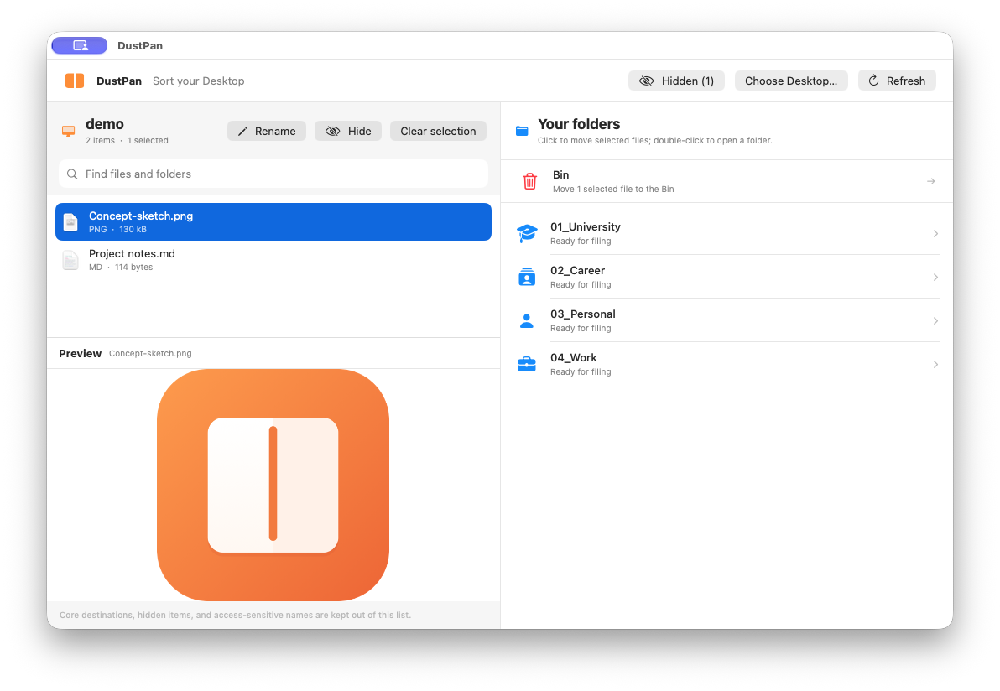
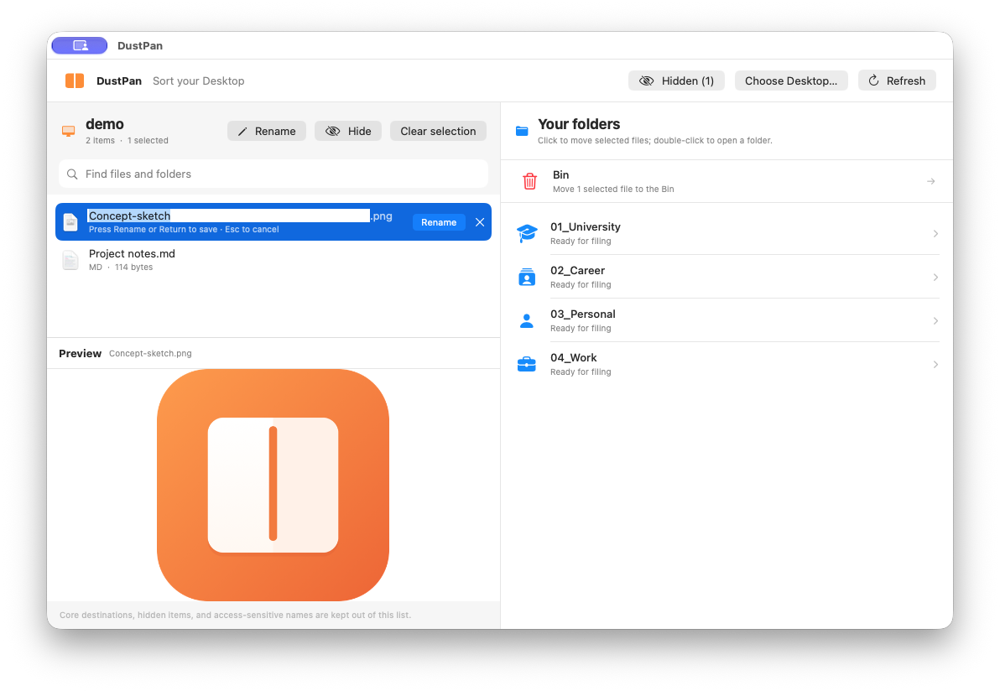

# DustPan

DustPan is a native macOS app for quickly reviewing Desktop files and manually moving them into existing folders.

## Overview

DustPan puts a searchable file list and Quick Look preview beside your destination folders. Select one or more items, then click a folder to file them; double-click a folder to browse inside it. Rename, hide, Bin, and Undo controls keep common cleanup actions close at hand.

The destination pane shows folder names instead of local filesystem paths. In a destination, click a subfolder to move the selection there or double-click to open it.

## Get started

1. Open `DustPan.xcodeproj` in Xcode.
2. Select the **DustPan** scheme and press **Run**.
3. If prompted, choose the Desktop (or another source folder) that you want to organise.
4. Select a file to preview it, then click a destination folder to move it.

You can also build the Swift package from Terminal with `swift build`.

## Included safeguards

- Shows ordinary files and folders from the selected source folder, with search and Quick Look preview.
- Lets you hide items from DustPan without moving them or changing their Finder visibility. Restore them individually or use **Unhide all** for the currently selected source folder.
- Moves only items you select, rejects destination symbolic links and name collisions, and verifies file identity before Undo.
- Keeps the separate scheduled Desktop organisation workflow separate; this app does not run it automatically.
